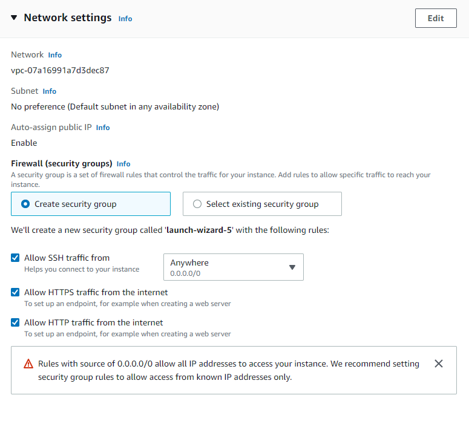
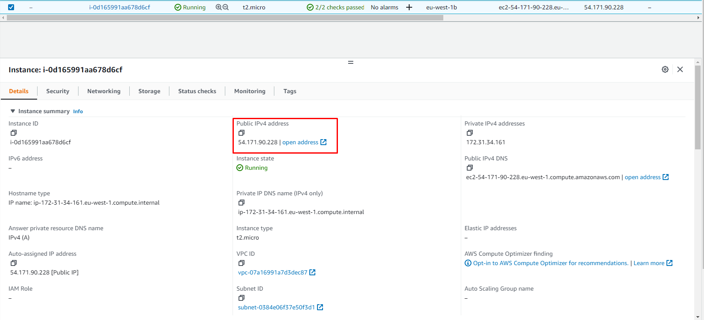
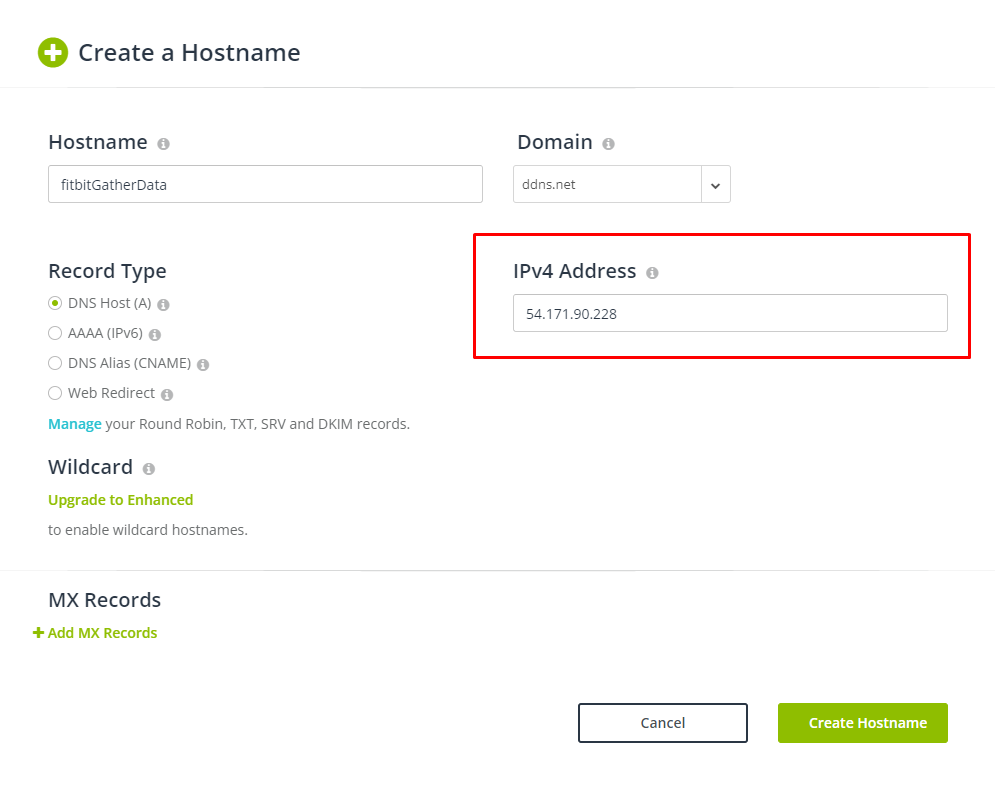
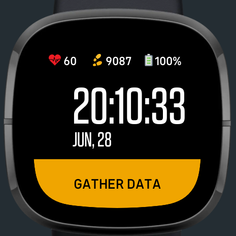

# FitbitGatherDataMechanism

Mechanism to gather Sensor Data from Fitbit devices. Mechanism used to gather the [WEDA-FALL](https://github.com/joaojtmarques/WEDA-FALL) dataset.

Any questions you may have, feel free to contact joaojtmarques@tecnico.ulisboa.pt.

## Context

Fitbit developed the SDK in a way that developers are not able to communicate with any device other than the smartphone associated with the watch, where the Fitbit application is installed and set up. In the smartphone, there is the Companion, an additional JavaScript runtime environment which exists within the Fitbit mobile application.

If there is the need to communicate with an endpoint on the internet (e.g. a server), the communication must be established with the Companion API and not with the smartwatch directly. The [Messaging API](https://dev.fitbit.com/build/guides/communications/messaging/) or the [File Transfer API](https://dev.fitbit.com/build/guides/communications/file-transfer/) are responsible for establishing contact between the smartwatch and the smartphone. This work uses the Messaging API.

Communication with a device on the internet is only possible if the endpoint is considered secure, i.e., an HyperText Transfer Protocol (HTTP) server is not deemed secure; instead, it must be HyperText Transfer Protocol Secure (HTTPS).

## The Server

The Server of this mechanism is a HTTPS Server. The following was done to setup the server.

1. The Server runs in an Amazon EC2 t2.micro instance, the Ubuntu 20.04 LTS free
tier eligible Amazon makes available. Naturally, so that this mechanism works, port 443 (standard port for HTTPS traffic) must be opened to traffic from external sources. Also allow SSH and HTTPS traffic.

After creating the Amazon EC2 t2.micro instance, you can check its Public IP under the details tab.

2. Copy the *server/* folder to the EC2 t2.micro instance. You can use the following command:
```
sudo scp -i <path_to_key_pair> -r server/ ubuntu@<machine_public_ip>:
```
3. Connect the Amazon EC2 t2.micro instance. Afterwards, execute the following commands:
```
sudo apt update
sudo apt upgrade
sudo apt install nodejs
```
4. Head over to [No-Ip](https://www.noip.com/). After log in, create a new hostname, and change its IPv4 Addres to your Amazon EC2 t2.micro instance Public IP.

Your new hostname is now forwarding requests to your Amazon EC2 t2.micro instance.

5. On your Amazon EC2 t2.micro instance, execute the following commands:

```
sudo apt install certbot
sudo certbot certonly --standalone
```
Make sure to provide the hostname created in 4 when you are asked. In my case, it this demo's case, it was fitbitgatherdata.ddns.net.

6. Lastly, you just need to copy the generated files to the current folder, and rename them to the files accordingly with the code. Therefore, run the following commands:
```
sudo cp /etc/letsencrypt/live/fitbitgatherdata.ddns.net/fullchain.pem cert.pem
sudo cp /etc/letsencrypt/live/fitbitgatherdata.ddns.net/privkey.pem key.pem
```


To run the server, run the following command:

```
sudo node index.js
```


## The Smartwatch

The following is needed to setup the smarwatch:

1. Head over to [Fitbit Studio](https://studio.fitbit.com/).
2. After logging in, create a new empty project, with whatever name you want.
3. Upload the files inside the *clockFace/* folder (just files inside, not the *clockFace/* folder!) to the Fitbit Studio.
4. Change [line 14 of clockFace/companion/index.js](https://github.com/joaojtmarques/FitbitGatherDataMechanism/blob/main/clockFace/companion/index.js#L14) to the hostname created in No-IP. You must keep the *https://* in the url.
5. Run the code.


## Collecting data

The main clockface of the watch should look like this: 

Whenever colleting data, after having the server running, one can lick the 'GATHER DATA' button. It should appear the following interface:


While the smartwach has this interface, it is streaming data towards the server. It is set up to stream data at 50Hz. You can change this value in the code. It is probably not possible to go too much higher.

When streaming data, the server creates a new file with the current time in milliseconds. If you want, you can rename a new file to whatever name you want, for instance a dataset folder outside the server folder. For instance, you can run:

```
mv 1*.txt ../data/D12/U50_R03.txt
```

If you are working in a Github repository in Amazon EC2 t2.micro instance, you can simply push the files and pull them in you local computer.